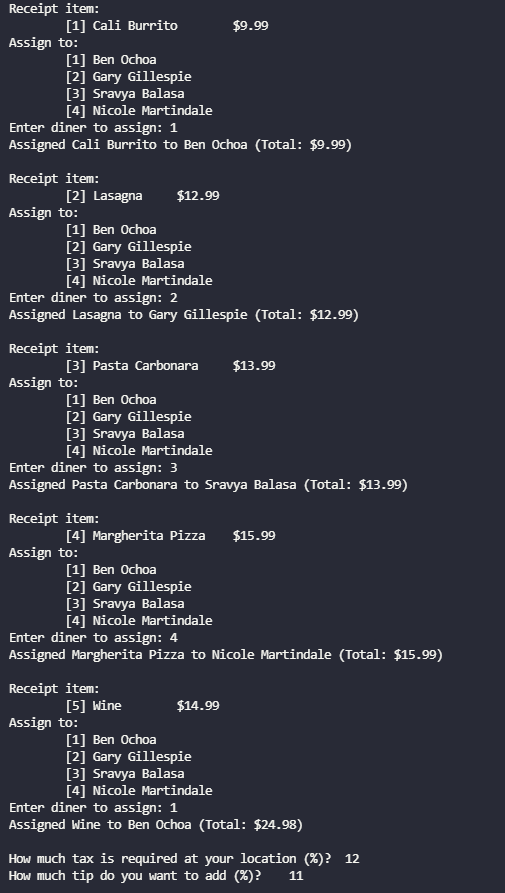
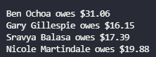

## Scripting Project 3: Splitting Bills

## Due Date: 4 June 2021 at 11:59 pm

### Project Description

In this project, you'll begin to build your scripting abilities by creating a script that splits a bill between some people and calculates how much each person owes. This project will help acclimate you to:

- Using variables and positional parameters.
- Understanding control-flow logic with user input.
- Woking with for loops in bash.
- Reading user input in bash.

Your script will take in the following:

- A file with a bash array called NAMES which has all the names.
- A file with a bash array called MENU which has all the menu items and prices in the format `<item,$price>`.

**Please make sure to name the arrays as shown above.** 
**Please do NOT change the names of variables that are provided as they will mess up the grading script**

Example Output (using `names.sh` and `menu.sh` provided in `tests/test1` directory):

**Do not hard code output!** Due to how we test the scripts, it will result in a failure of nearly all test cases.

### Provided Files

After running `gethw`, you'll get a file called
`split_bill.sh`. The general outline of seven functions are provided.
It is your job to implement the seven incomplete functions (`create_billings`, `assign_dishes`, `get_tax`, `get_tip`, `calculate`, `print_names`, and `print_error_and_exit`).

### How to Run

Usage: `./split_bill.sh -n <name_file> -m <menu_file>`

In order to run this script you will need to provide 2 files with 2 flags:

- First specify the file containing the names (with the NAMES array), using the `-n` flag
- Then specify the menu file (with the MENU array), using the `-m` flag. This is the file 
  with the menu items seperated by a comma (no space) in this format:
  `<item,$price>`

### Testing
If you would like to reproduce the example shown above, please follow the steps below:
1. run `./sol_split_bill -n <path/to/names.sh file> -m <path/to/menu.sh file>`
1. Assign the items as shown above

In order to perform your own testing follow the steps below, keep in mind by redirecting output to a file you will not see any prompts to assign people to items. You can just enter the numbers without the prompts and the texts will be redirected to the `out.txt` files. We recommend you only run this test to verify the print statements are in correct order, after you confirm correctness of your script.
1. run `./split_bill.sh -n <path/to/names.sh file> -m <path/to/menu.sh file> > out1.txt`
1. run `./sol_split_bill -n <path/to/names.sh file> -m <path/to/menu.sh file> > out2.txt`
1. run `diff out1.txt out2.txt`, If `diff` produces no output, then your files are identical!

In the tests folder you will find 2 sub-directories called `test1` and `test2`
each will have sample `menu.sh`, and `names.sh` files and sample output for you to test your code. 
We have also provided a solution binary file for you to run any test case and test your code.
You can run the C binary as: 
- `./sol_split_bill -n <name_file> -m <menu_file>`

**These tests are not comprehensive and you are encouraged to create your own test folders to further test your code.**

### Turn-in Instructions

Type `turnin15L` then follow the prompts :)

### Tips

 - In order to keep all print statements consistent, please use the provided strings for console text outputs.
 - In order to print tabs (`\t`), newlines (`\n`), and etc. you can use `echo` commmand with the `-e` flag.
 - Keep in mind that having the same variable name for loop indices can potentially cause conflicts.

## Good luck! Start early and _Finish_ early!
